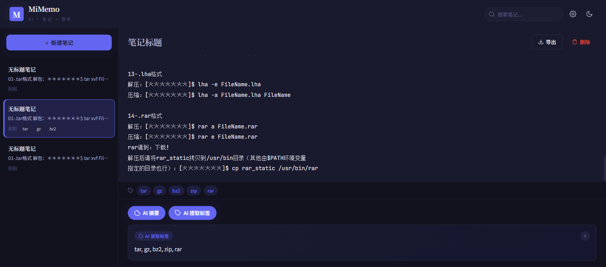

# MiMemo — AI 智能记事本

一个调用小米 MiMo API 的智能笔记应用，支持 AI 摘要生成和标签提取。



## 功能特性

- **笔记管理** — 创建、编辑、删除笔记，支持 Markdown 格式
- **AI 摘要** — 一键生成笔记内容摘要（调用 MiMo-V2.5-Pro API）
- **AI 标签提取** — 自动从笔记中提取关键词标签
- **本地存储** — 所有数据存储在浏览器 localStorage，无需服务器
- **搜索与筛选** — 关键词搜索 + 标签过滤
- **暗色模式** — 支持浅色/深色主题切换
- **导出功能** — 将笔记导出为 Markdown 文件

## 技术栈

- HTML5 + CSS3 + JavaScript (ES6+)
- [Xiaomi MiMo API](https://platform.xiaomimimo.com/) — AI 推理能力
- CSS Custom Properties — 主题系统
- localStorage — 客户端数据持久化

## 快速开始

1. 克隆项目
   ```bash
   git clone https://github.com/your-username/mimemo.git
   cd mimemo
   ```

2. 打开 `index.html` 即可使用（无需构建）

3. 点击右上角 ⚙️ 配置你的 MiMo API Key
   - 前往 [MiMo 开放平台](https://platform.xiaomimimo.com/console/api-keys) 获取 API Key

## API 配置

本项目使用 MiMo API 的 Anthropic 兼容格式：

- **Endpoint**: `https://token-plan-cn.xiaomimimo.com/anthropic/v1/messages`
- **模型**: `mimo-v2.5-pro`
- **认证方式**: `x-api-key` header

## 项目结构

```
mimemo/
├── index.html          # 主页面
├── css/
│   └── style.css       # 样式（Ink & Light 设计系统）
├── js/
│   ├── app.js          # 主逻辑
│   ├── storage.js      # localStorage 封装
│   ├── api.js          # MiMo API 调用
│   ├── editor.js       # 编辑器组件
│   └── utils.js        # 工具函数
└── assets/
    └── favicon.svg     # 图标
```

## 设计系统

采用 "Ink & Light" 设计语言：

- **字体**: Noto Serif SC (标题) + Noto Sans SC (正文) + JetBrains Mono (代码)
- **配色**: 深色墨水质感 + 紫色强调色
- **动效**: 微交互 + 渐入动画

## 申请信息

本项目为申请 [Xiaomi MiMo Orbit 百万亿 Token 创造者激励计划](https://100t.xiaomimimo.com/) 而创建。

- **申请时间**: 2026年5月
- **使用场景**: 个人效率工具，AI 辅助笔记管理
- **API 使用**: MiMo-V2.5-Pro 模型，用于文本摘要和标签提取

## License

MIT
